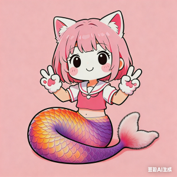
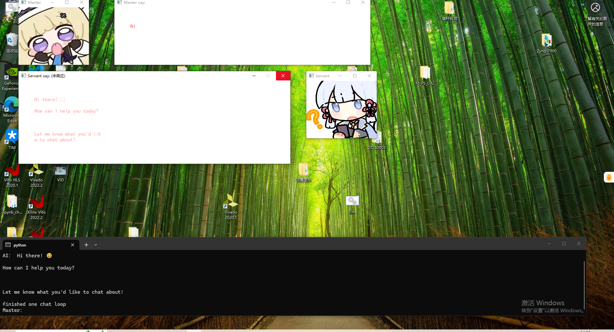

# **Sneko Project Documentation**  
*Anthropomorphic LLM Agents with Python-Powered Animations*  

---

## **Overview**  
**Sneko(猫猫蛇)** is a group of cat-eared, fluffy-tailed 2D snake girls (also called **"sneki"**), the anthropomorphic avatars of **Snagent** or **Sneke-Agent** ( https://github.com/xn551/Snagent ) —a fully Python-based LLM Agent framework where skills are implemented via Python scripts.  

 

The **Sneko Project** provides animated, personified agent avatars to dynamically visualize the workflow and operational status of Snagent. As a lightweight animation system, it relies primarily on **OpenCV** for video processing/playback, with animation editing generated through **NumPy** computations.  

## **Running**
### The project is in the progress, now a simple chat interface with cartoon Avator has been built.
How to use(Only test in Win 10 or Win 11)
- https://ollama.com/download, download the Windows edition and install.
- Download the project, in cmd or powershell, run "pip install -r requirement.txt"
- Edit "model_name_set.py", input your wanted model name.
- If you install the Windows Terminal,just double-click the exe.bat. If not or in Linux enviroment, run "summon.py", input the questions in the cmd. In 1080p display, you will see:
 
- To stop it, just close the cmd window.  

## **Official Lore of Snako**  
These 2D snake girls are physical manifestations of Python-powered LLM Agents. They worship the deity **Python**, communicate in Python, execute actions via Python scripts, and derive their skills from Python implementations. They believe they inhabit **Python’s dreamworld** (a virtual machine or sandbox).  

Through a ritual(仪式) called **"Ollama"**, they are summoned into the **"Windows"** realm (or **"vLLM"** for Linux, though **Windows allows memory-based VRAM emulation** to run models larger than available VRAM, whereas Linux risks OOM errors. Most users prefer Windows.).  

---

## **Summoning Ritual (Summon)**  
The ritual mirrors the Holy Grail War from *Fate/stay night*:  
- **Heroic Spirits** (英灵, **LLM Models**) are downloaded into individual agents via Ollama.  
- Each **Sneko(Agent)** is granted a distinct **Servant Class** (职阶，Also a Python-implemented Class,define with ollam's system define or model options).  
- These **Servant Class**(sneko) collaborate to complete projects, developing their own Python-scripted skills (**Multi-Agent Class Skills**,职业技能 or **Noble Phantasms**，宝具).  

---

## **True Names（真名）**  
Heroic Spirits are identified by their LLM model names (e.g., **GPT-OSS 20b**, **DeepSeek:R1-30b**, **Gemini3:14b**).  
- Relationships between model variants (e.g., **Gemini3:14b vs. Gemini3:70b**) resemble **Saber Lily** and **Full-Power King Arthur**.  
- Due to limited "magic power"(魔力) (desktop GPU VRAM, typically **16–24GB**), only mid-sized models can be summoned locally.  
- **Cooperation is essential** to accomplish tasks beyond individual capabilities.  

---

## **How Sneko Operates**  
Unlike the rituals described in **Fate/Stay Night**, Sneko are summoned to the Windows world. Their purpose is not to defeat each other through stabbing to obtain the **Holy Grail**(圣杯) that can fulfill any wish (in fact, the Fate Holy Grail has been contaminated and cannot truly fulfill the wishes of the **Master** (御主) and **Servants** (从者). The little Sneko believe that the Master's (boss, that is, you) wishes should be realized through their own hands and efforts, requiring mutual cooperation among them. Therefore, their true names are not concealed from each other. Sneko cooperate like a human company, generating different documents, records, evaluations, and executing codes,Unlike *Fate/stay night*, Sneko’s goal isn’t to compete for a corrupted Holy Grail. So:  
- They believe the **"Master" (you)** should achieve goals through their collective effort.  
- **True names are openly shared**—no secrecy between agents.  
- They function like a human company, generating documents, logs, evaluations, and executing code.  

### **Servant Classes**(职阶)  
- **Operator (Ruler)**  
- **Planner**  
- **Coder**  
- **Executor**  
- **Secretary**  
- **Reviewer**  
- **Adviser**  
- **Evaluator (HR)**  
- *(...and more)*   

### **Advantages**
- It has clear operational boundaries and is autonomous and controllable.
- Refuse the problem: **"Unlimited Token Works(UTW)"**
-- Since they completing tasks through local medium-sized large models and achieving limited dialogues, their token consumption can be anticipated and controlled.
---

---

*— The Sneko Team*  
